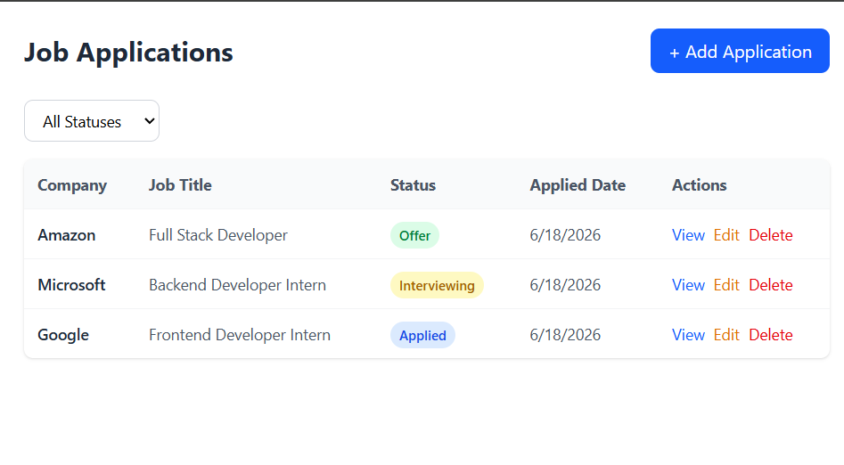
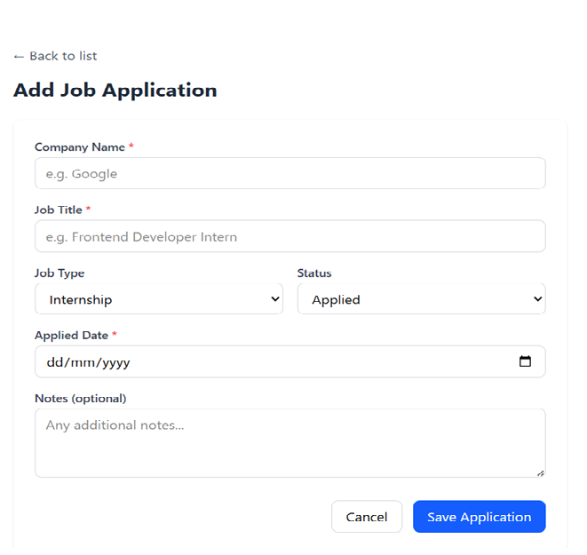
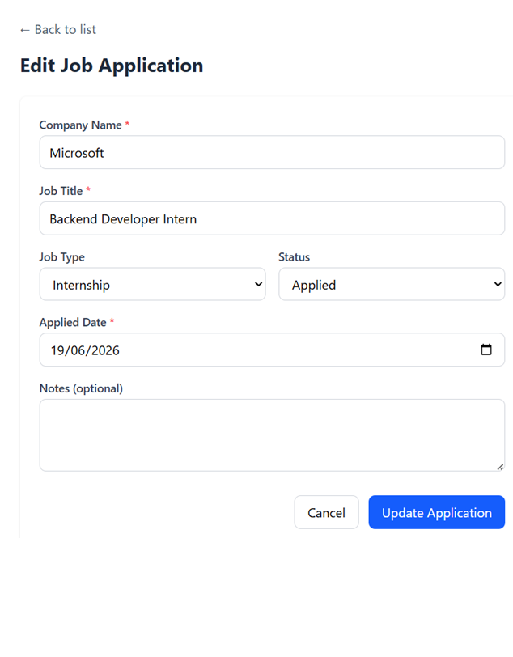

# Mini Job Application Tracker

A full-stack web application to track job applications through different hiring stages — built as part of a Full Stack Internship assignment.

## 📸 Screenshots

### Application List Page

### Add Application Form

### Edit Application Form

## 🧰 Tech Stack

| Layer | Technology |
|---|---|
| Frontend | React + TypeScript + Vite |
| Styling | Tailwind CSS v4 |
| Backend | Node.js + Express.js + TypeScript |
| Database | PostgreSQL |
| ORM | Prisma (v7) |
| API Style | REST |
| Routing | React Router DOM |
| HTTP Client | Axios |

## ✨ Features

- View all job applications in a clean, responsive table
- Add new job applications with form validation
- Edit existing applications
- Delete applications with a confirmation step
- Filter applications by status (Applied, Interviewing, Offer, Rejected)
- Backend validation and proper error handling
- TypeScript across both frontend and backend (no `any` types)

## 📋 Prerequisites

- Node.js (v18 or higher)
- npm
- PostgreSQL (or use Prisma's local dev database — see below)

## ⚙️ Installation

### 1. Clone the repository

\`\`\`bash
git clone <your-repo-url>
cd job-tracker
\`\`\`

### 2. Backend Setup

\`\`\`bash
cd backend
npm install
\`\`\`

Create a `.env` file in the `backend` folder (see `.env.example`):

\`\`\`env
DATABASE_URL="your-postgresql-connection-string"
PORT=5000
\`\`\`

Run database migrations:

\`\`\`bash
npx prisma db push
npx prisma generate
\`\`\`

### 3. Frontend Setup

\`\`\`bash
cd ../frontend
npm install
\`\`\`

## 🚀 Running in Development Mode

### Start the backend (from `backend` folder)

\`\`\`bash
npm run dev
\`\`\`

Backend runs on **http://localhost:5000**

### Start the frontend (from `frontend` folder, in a separate terminal)

\`\`\`bash
npm run dev
\`\`\`

Frontend runs on **http://localhost:5173**

## 🗄️ Database Schema

**Application**

| Field | Type | Notes |
|---|---|---|
| id | UUID | Auto-generated, primary key |
| companyName | String | Required |
| jobTitle | String | Required |
| jobType | Enum | Internship / FullTime / PartTime |
| status | Enum | Applied / Interviewing / Offer / Rejected |
| appliedDate | DateTime | Required |
| notes | String | Optional |
| createdAt | DateTime | Auto-set |
| updatedAt | DateTime | Auto-updated |

## API Endpoints

| Method | Endpoint | Description |
|---|---|---|
| GET | `/applications` | List all applications. Supports `?status=` and `?search=` query params |
| GET | `/applications/:id` | Get a single application |
| POST | `/applications` | Create a new application |
| PATCH | `/applications/:id` | Update an application partially |
| DELETE | `/applications/:id` | Delete an application |

### Example Request — Create Application

\`\`\`json
POST /applications
Content-Type: application/json

{
  "companyName": "Google",
  "jobTitle": "Frontend Developer Intern",
  "jobType": "Internship",
  "status": "Applied",
  "appliedDate": "2026-06-15",
  "notes": "Applied via LinkedIn"
}
\`\`\`

## 🔐 Environment Variables

### Backend (`.env`)

| Variable | Description |
|---|---|
| `DATABASE_URL` | PostgreSQL connection string |
| `PORT` | Port for the backend server (default: 5000) |

See `backend/.env.example` for reference.

## 📁 Project Structure

\`\`\`
job-tracker/
├── backend/
│   ├── prisma/
│   │   └── schema.prisma
│   ├── src/
│   │   ├── config/
│   │   │   └── prisma.ts
│   │   ├── controllers/
│   │   │   └── applicationController.ts
│   │   ├── routes/
│   │   │   └── applicationRoutes.ts
│   │   └── index.ts
│   ├── .env.example
│   └── package.json
├── frontend/
│   ├── src/
│   │   ├── components/
│   │   ├── pages/
│   │   │   ├── ApplicationListPage.tsx
│   │   │   ├── AddApplicationPage.tsx
│   │   │   └── EditApplicationPage.tsx
│   │   ├── services/
│   │   │   └── applicationService.ts
│   │   ├── types/
│   │   │   └── application.ts
│   │   └── App.tsx
│   └── package.json
├── screenshots/
└── README.md
\`\`\`

## Notes

- This project uses Prisma's local dev Postgres server (`npx prisma dev`) for local development. For production, replace `DATABASE_URL` with a standard PostgreSQL connection string.
- TypeScript `any` type was avoided throughout the codebase per assignment guidelines.

##  Author

Built by Enzela as part of a Full Stack Internship application.